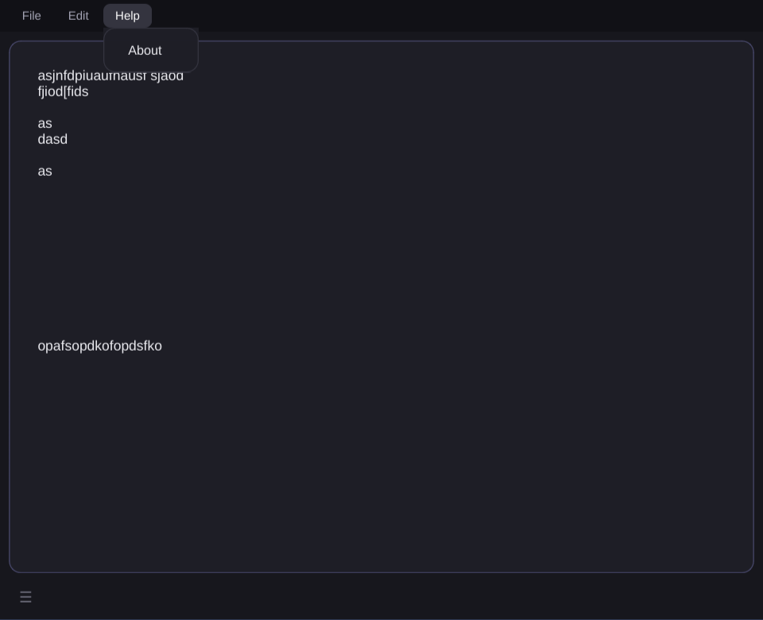
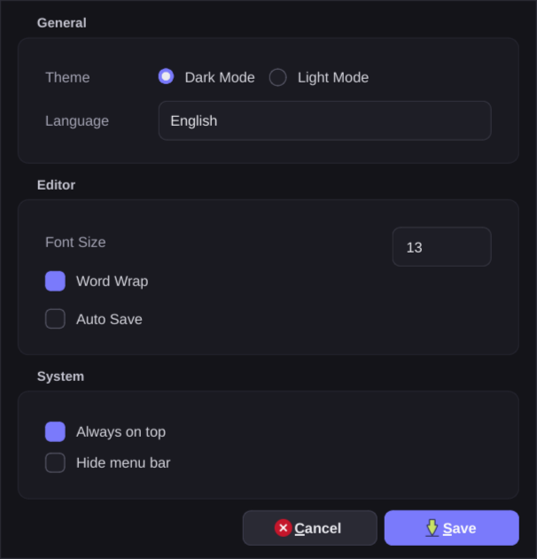
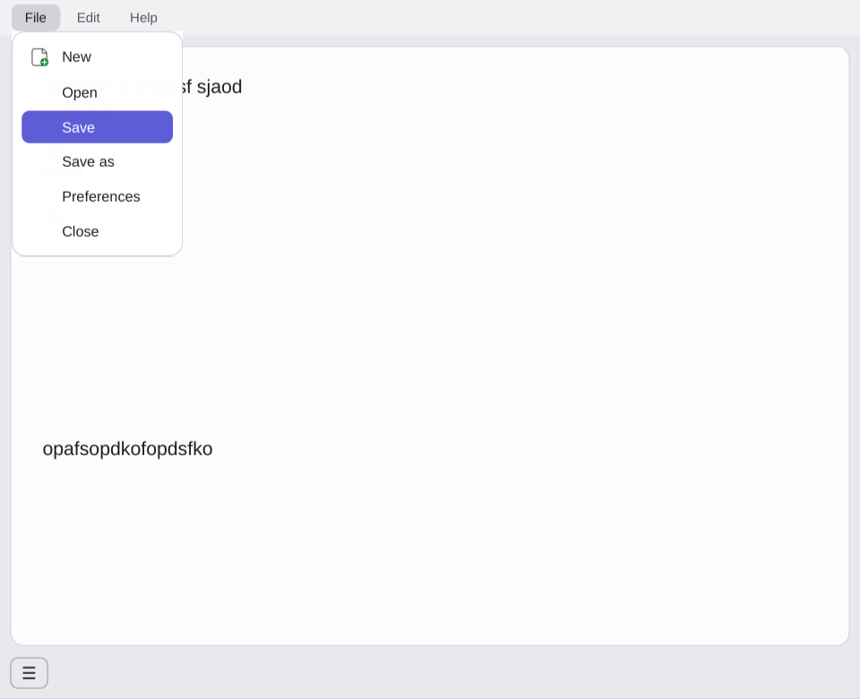

# QNotes

Lightweight sticky-note style notepad built with C++ and Qt6. Quick notes with dark/light theme, auto-save, and EN/PL translations.

## Screenshots

 
 



## Requirements

- Qt 6 (Widgets + LinguistTools)
- CMake 3.16+, C++17+ compiler

## Run

```bash
cmake -B build
cmake --build build
./build/QNotes
```
